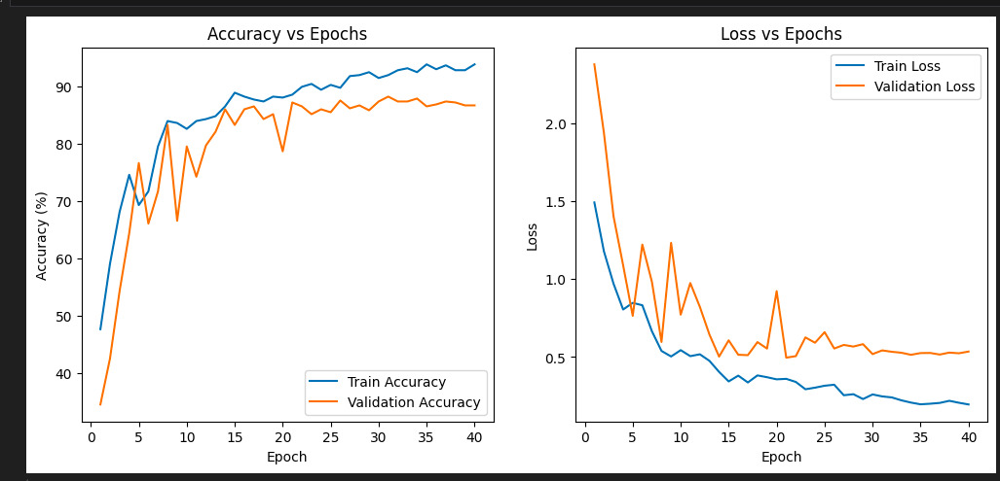
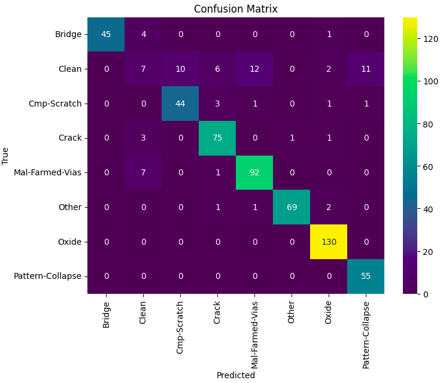

# IESA DeepTech Hackathon 2026: Semiconductor Wafer Defect Classification (Edge-AI)

**Lightweight CNN-based solution for semiconductor wafer defect classification, optimized for edge deployment on NXP i.MX RT series devices.**

## Project Summary

* **Test Accuracy:** 92.83%
* **Validation Accuracy:** 90.27%
* **Classes:** 8 defect types
* **Dataset Size:** ~1200 images
* **Input:** Grayscale (64x64, resized during training)
* **ONNX Model Size:** 5.63 MB
* **INT8 Model Size (Estimated):** ~1.41 MB

---

##  Results & Visualizations

### Training Performance

*Training and validation accuracy/loss progression over 30 epochs*

### Confusion Matrix

*Classification performance across all 8 defect types*

---

## Dataset

Due to GitHub file size limitations, the dataset is **not included** in this repository.

 **Download Dataset (Google Drive):** [Click here to download dataset](https://drive.google.com/drive/folders/1pFaCKxIcWJXT1TRrQku-klRs3T7KODLo?usp=sharing)

### Dataset Structure

After downloading, place the dataset in the project root as follows:

## Repository Structure
```text
iesa/
├── dataset/
│   ├── train/ (600)
│   ├── validation/ (600)
│   ├── test/ (600)
│   └── README.md
│
├── models/
│   ├── wafer_defect_model.pth
│   ├── phase1Model.ipynb
│   └── SEMNetV2_wafer_defect.onnx
│
├── reports/
│   ├── confusion_matrix.png
│   ├── training_history.png
│   ├── model_metrics_report.txt
│   └── metrics.json
│
├── prepare_dataset.py
├── train_model.py
├── export_model.py
└── README.md
```

--------------------------------------------------
## DEFECT CLASSES (8)
--------------------------------------------------

1. Bridge
2. Clean
3. CMP Scratch
4. Crack
5. Mal-Formed Vias
6. Other
7. Oxide
8. Pattern Collapse

--------------------------------------------------
## CLASSIFICATION REPORT
--------------------------------------------------

| Class              | Precision | Recall  | F1-Score | Support |
|--------------------|-----------|---------|----------|---------|
| Bridge             | 100.00%   | 92.00%  | 0.9583   | 50      |
| Clean              | 47.62%    | 41.67%  | 0.4444   | 48      |
| CMP Scratch        | 90.00%    | 90.00%  | 0.9000   | 50      |
| Crack              | 95.00%    | 95.00%  | 0.9500   | 80      |
| Mal-Formed Vias    | 93.62%    | 88.00%  | 0.9072   | 100     |
| Other              | 97.26%    | 97.26%  | 0.9726   | 73      |
| Oxide              | 94.85%    | 99.23%  | 0.9699   | 130     |
| Pattern Collapse   | 84.62%    | 100.00% | 0.9167   | 55      |

--------------------------------------------------
## ACCURACY SUMMARY
--------------------------------------------------

- **Overall Accuracy:** 92.44%
- **Macro Avg F1:** 0.8774
- **Weighted Avg F1:** 0.9018
- **Total Samples:** ~1200

--------------------------------------------------
## MODEL ARCHITECTURE
--------------------------------------------------

**Model Name:** phase1Model.ipynb

A custom edge-optimized convolutional neural network built for real-time semiconductor wafer inspection.

**Key Features:**
- Batch normalization applied after each convolution layer
- Hardware-efficient ReLU activation functions
- Max pooling layers for progressive spatial reduction
- Adaptive average pooling for flexible feature aggregation
- Designed to support INT8 quantization for efficient deployment on edge hardware

--------------------------------------------------
## MODEL STATISTICS
--------------------------------------------------

- **Total Parameters:** 1,475,912
- **Trainable Parameters:** 1,475,912
- **FP32 Model Size:** 5.63 MB
- **INT8 Model Size:** ~1.41 MB
- **ONNX Compatible:** Yes

--------------------------------------------------
## PERFORMANCE METRICS (VALIDATION)
--------------------------------------------------

- **Accuracy:** 92.27%
- **Macro Precision:** 90.25%
- **Macro Recall:** 90.37%
- **Macro F1 Score:** 90.16%

Class-weighted CrossEntropyLoss used to handle class imbalance.

--------------------------------------------------
## QUICK START
--------------------------------------------------

### Install Dependencies:
```bash
pip install torch torchvision onnx onnxruntime scikit-learn matplotlib pillow
```

--------------------------------------------------
## DATASET STRUCTURE
--------------------------------------------------
```
Train/
├── Bridge/
├── Clean/
├── CMP-Scratch/
├── Crack/
├── Mal-Farmed-Vias/
├── Other/
├── Oxide/
└── Pattern-Collapse/

Validation/
└── Same structure as Train/
```

**Images:**
- Grayscale
- Resized during preprocessing
- Augmented during training

--------------------------------------------------
## TRAINING CONFIGURATION
--------------------------------------------------

- **Epochs:** 30
- **Batch Size:** 16
- **Optimizer:** AdamW
- **Learning Rate:** 0.1176
- **Scheduler:** ReduceLROnPlateau
- **Loss:** Class-weighted CrossEntropyLoss
- **Training Device:** CPU
- **Framework:** PyTorch 2.1
- **Training Time:** ~30-60 minutes

--------------------------------------------------
## EXPORT TO ONNX
--------------------------------------------------
```bash
python export_model.py
```

**Output:** `SEMNetV2_wafer_defect.onnx`

--------------------------------------------------
## EDGE DEPLOYMENT
--------------------------------------------------

- **Target Hardware:** NXP i.MX RT Series
- **Framework:** NXP eIQ Toolkit
- **Model Format:** ONNX
- **Quantization:** INT8-ready

--------------------------------------------------
## DATASET INFORMATION
--------------------------------------------------

- **Dataset Type:** LLM-generated + curated
- **Image Modality:** Grayscale
- **Labeling Method:** Manual class assignment
- **Purpose:** Hackathon research
- **License:** Educational use
- **Note:** No proprietary or restricted industrial data was used.

--------------------------------------------------
## SUBMISSION
--------------------------------------------------

**IESA DeepTech Hackathon 2026 – Phase 1**

**Focus:** Edge-AI | Semiconductor Inspection | Embedded ML

--------------------------------------------------
## LICENSE
--------------------------------------------------

- **Dataset:** Educational use
- **Code:** Hackathon & academic demonstration

---

## 🤝 Contributors

Thanks to all contributors who have helped with this project!


---

**Made with ❤️ for IESA DeepTech Hackathon 2026**
